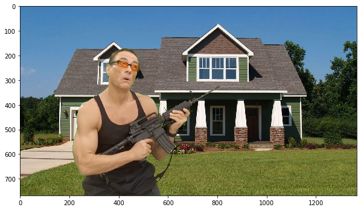
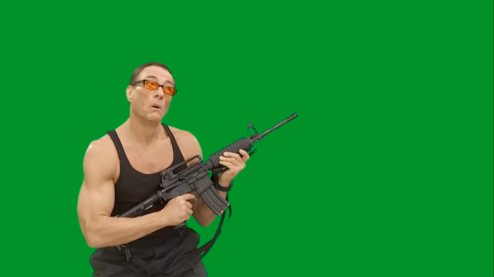
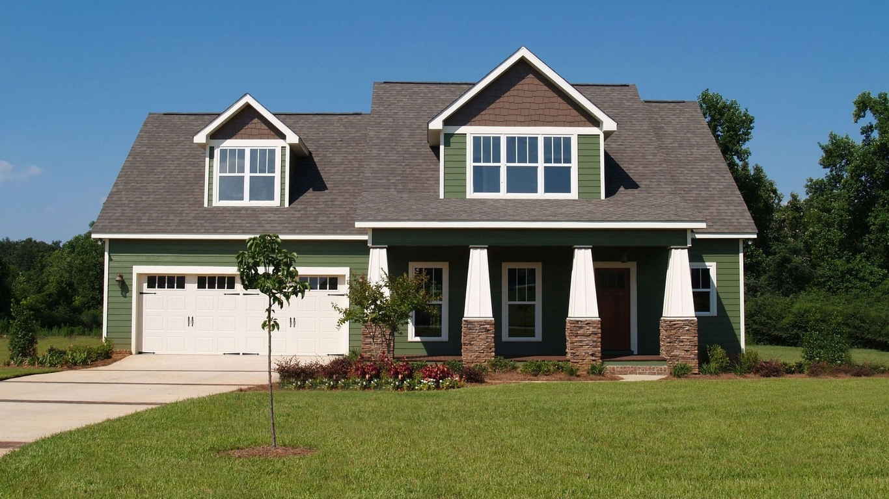
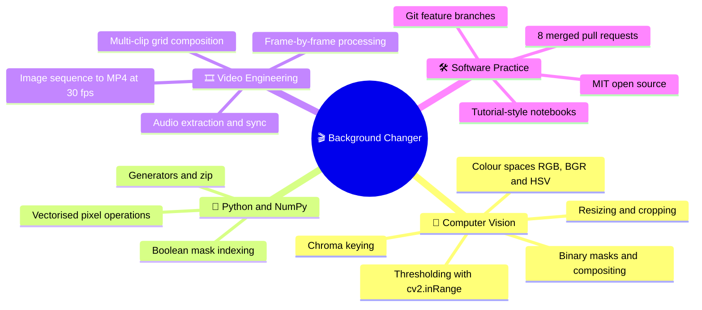
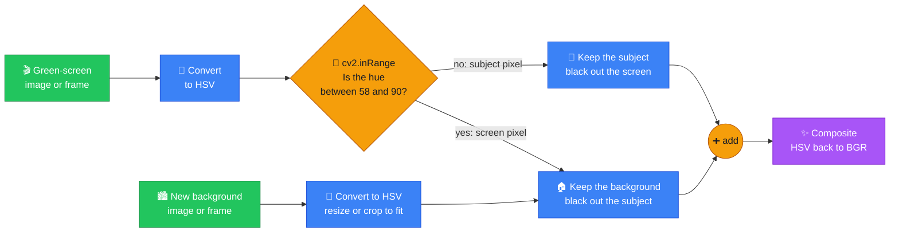
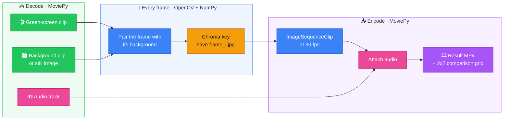
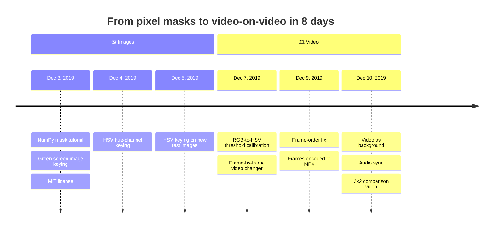

<div align="center">

# 🎬 Background Changer

$\color{#22c55e}{\textsf{Green screen in}}\ \color{#94a3b8}{\Rightarrow}\ \color{#3b82f6}{\textsf{any world out}}$

**A classical computer-vision engine that replaces green- and blue-screen backgrounds in images and videos.<br/>It can even put one video into the background of another.**

[](https://www.python.org/)
[](https://opencv.org/)
[](https://numpy.org/)
[](https://zulko.github.io/moviepy/)
[](https://matplotlib.org/)
[](https://jupyter.org/)
[](LICENSE)



[](https://youtu.be/ICxn9NCc5ZM)

[🎥 Demo](#-demo) • [🧠 Skills](#-skills-demonstrated) • [⚙️ How it works](#%EF%B8%8F-how-it-works) • [📚 Notebooks](#-learning-path) • [🧩 Challenges](#-engineering-challenges) • [🚀 Run it](#-getting-started)

</div>

---

## ✨ Overview

> [!IMPORTANT]
> I built a **background replacement engine from scratch in Python**, using classical computer vision only. It uses no ML models and no video-editing software.
>
> It starts with pixel-level NumPy masks and grows into image compositing with OpenCV. It ends as a **full video pipeline** that swaps a green screen for a still image **or another video**, keeps the audio in sync, and renders a side-by-side comparison video.
>
> I shipped it in **8 days** through **8 merged pull requests** on feature branches.

<div align="center">

| 📓 Notebooks | 🎯 Use cases | 🔀 Merged PRs | ⏱️ Built in | 🤖 ML models used |
| :---: | :---: | :---: | :---: | :---: |
| **4** | **3** | **8** | **8 days** | **0** |

</div>

---

## 🎥 Demo

### 🖼️ Image with a new image background

<table>
  <tr>
    <th align="center">1️⃣ Image with a green screen</th>
    <th align="center">2️⃣ New background</th>
    <th align="center">3️⃣ Result</th>
  </tr>
  <tr>
    <td></td>
    <td></td>
    <td></td>
  </tr>
</table>

> The same notebook also keys a **blue-screen** portrait. It also picks out the **green candies** in a colourful pile using hue alone and places them on a wooden table. See [change_greenscreen.ipynb](change_greenscreen.ipynb).

### 🎞️ Video with a still-image background

<table>
  <tr>
    <th align="center">1️⃣ Green-screen video</th>
    <th align="center">2️⃣ Still background</th>
    <th align="center">3️⃣ Result ▶️</th>
  </tr>
  <tr>
    <td><a href="videos/van_damme_greenscreen.mp4"></a></td>
    <td></td>
    <td><a href="https://youtu.be/V28qUhj_5ro"></a></td>
  </tr>
</table>

### 🎬 Video with a video background

<table>
  <tr>
    <th align="center">1️⃣ Green-screen video</th>
    <th align="center">2️⃣ Background video ▶️</th>
    <th align="center">3️⃣ Result ▶️</th>
  </tr>
  <tr>
    <td><a href="videos/van_damme_greenscreen.mp4"></a></td>
    <td><a href="https://youtu.be/vCdBIRtsL6o"></a></td>
    <td><a href="https://youtu.be/WmcLKRxm7kY"></a></td>
  </tr>
</table>

### 📺 All results in one video

<div align="center">

<a href="https://youtu.be/ICxn9NCc5ZM"></a>

*A 2×2 grid rendered by the pipeline. The top row shows the original clip and the background clip. The bottom row shows the generated result.*

</div>

---

## 🧠 Skills demonstrated



---

## ⚙️ How it works

Every image and every video frame goes through the same **chroma-key** pipeline:



The core of the algorithm fits in a few lines:

```python
hsv    = cv2.cvtColor(frame, cv2.COLOR_RGB2HSV)
bg_hsv = cv2.cvtColor(background, cv2.COLOR_BGR2HSV)

# 1. White wherever the pixel is green-screen hue (OpenCV hue runs from 0 to 179, green is about 60)
mask = cv2.inRange(hsv, np.array([58, 0, 0]), np.array([90, 255, 255]))

# 2. Two complementary cut-outs
subject = hsv.copy()
subject[mask != 0] = 0       # remove the green screen
backdrop = bg_hsv.copy()
backdrop[mask == 0] = 0      # cut a subject-shaped hole

# 3. The two cut-outs never overlap, so adding them merges them
result = cv2.cvtColor(subject + backdrop, cv2.COLOR_HSV2BGR)
```

### 🌈 Why HSV instead of RGB?

In RGB, a shadow on the green screen changes all three channels at once, so a fixed RGB range misses dark or bright patches. HSV keeps **which colour** a pixel is (Hue) separate from **how bright** it is (Value). A threshold on Hue alone catches the whole screen.

| Colour space | Channels thresholded | Shadows and highlights | Where I used it |
| :--- | :--- | :---: | :--- |
| 🔴🟢🔵 **RGB** | All three | ❌ The range breaks when brightness changes | First blue-screen experiment |
| 🌈 **HSV** | Hue only | ✅ Hue stays stable | Candies, Van Damme image, both video pipelines |

### 🎞️ Video pipeline



Notebook 3 uses a still image as the background. Notebook 4 adds a moving background clip, keeps the soundtrack and renders the comparison grid.

---

## 📚 Learning path

The notebooks form a step-by-step tutorial. Each one builds on the one before, so read them in order:

| Step | Notebook | What it teaches | Key tools |
| :---: | :--- | :--- | :--- |
| 1️⃣ | [image_mask_using_numpy.ipynb](image_mask_using_numpy.ipynb) | How masks are made and applied to NumPy images (matrices) | `np.array`, boolean indexing |
| 2️⃣ | [change_greenscreen.ipynb](change_greenscreen.ipynb) | How to replace the green-screen background of an image with any other image, first with RGB thresholds and then with HSV | `cv2.inRange`, `cv2.cvtColor` |
| 3️⃣ | [automatic_video_background_changer.ipynb](automatic_video_background_changer.ipynb) | How to replace the background of a video with a fixed image, frame by frame | `VideoFileClip`, `iter_frames`, `ImageSequenceClip` |
| 4️⃣ | [automatic_video_background_changer_with_video_as_background.ipynb](automatic_video_background_changer_with_video_as_background.ipynb) | How to replace the background of a video with **another video**, keep the soundtrack, and build a comparison grid | `zip`, `set_audio`, `clips_array` |

---

## 🧩 Engineering challenges

| | Problem | How I solved it |
| :---: | :--- | :--- |
| 🌗 | RGB thresholds missed parts of the screen that were in shadow or overexposed | Converted to **HSV** and thresholded only the Hue channel, which stays stable when brightness changes |
| 🔀 | OpenCV uses **BGR** and MoviePy uses **RGB**. OpenCV `shape` is `(h, w, c)`, MoviePy `size` is `(w, h)`, and `cv2.resize` takes `(w, h)` | Added an explicit conversion at every point where data passes from one library to the other |
| 🔢 | `ImageSequenceClip` loads frames in alphabetical order, so `frame_10.jpg` comes before `frame_2.jpg` | Sorted the list of file names the same way before writing, so frame *i* is saved under the *i*-th name in that order. The frame order survives the round trip. |
| ⏱️ | The foreground and background clips have different lengths | Trimmed both clips to the same 40-second window, paired their frames with `zip()`, and put the original audio back on the result |
| 📐 | Background images were a different size from the subject | Cropped them or resized them with `INTER_AREA` to match the frame exactly |

---

## 📈 Development timeline



---

## 🚀 Getting started

```bash
git clone https://github.com/chadlimedamine/Background-Changer.git
cd Background-Changer

# MoviePy 2.x removed moviepy.editor, so pin MoviePy 1.x
pip install numpy opencv-python matplotlib "moviepy<2" notebook

# The video notebooks write their frames into these folders
mkdir image_sequence image_sequence_v

jupyter notebook
```

> [!NOTE]
> Notebook 4 reads `videos/new_york_street.mp4`. The file is too large to commit, so it is not in the repo. Save any background clip that is **at least 50 seconds long** under that name. The demo used [this New York streets video](https://youtu.be/vCdBIRtsL6o).

---

## 📁 Project structure

```text
Background-Changer/
├── 📓 image_mask_using_numpy.ipynb                                       # 1. How masks work
├── 📓 change_greenscreen.ipynb                                           # 2. Image chroma key (RGB, then HSV)
├── 📓 automatic_video_background_changer.ipynb                           # 3. Video + still-image background
├── 📓 automatic_video_background_changer_with_video_as_background.ipynb  # 4. Video + video background
├── 🖼️ images/                                                            # Input images and results
├── 🎞️ videos/                                                            # Green-screen source and rendered output
└── 📄 LICENSE                                                            # MIT
```

---

## 🔭 Ideas for v2

- [ ] 🪶 **Cleaner edges.** Use a morphological opening and a feathered alpha mask to remove the thin green fringe around the subject.
- [ ] ⚡ **Faster rendering.** Process frames in memory with `clip.fl_image()` instead of writing JPEGs to disk and reading them back.
- [ ] 🧠 **No green screen needed.** Replace the hue threshold with a person-segmentation model such as MediaPipe Selfie Segmentation.
- [ ] 📦 **Easier to use.** Wrap the pipeline in a command-line tool or a small Streamlit app.

---

<div align="center">

## 👤 Author

**Mohamed Amine Chadli**

[](https://github.com/chadlimedamine)

Released under the [MIT License](LICENSE) © 2019 Mohamed Amine Chadli

⭐ **If you enjoyed this project, consider giving it a star!** ⭐

</div>
